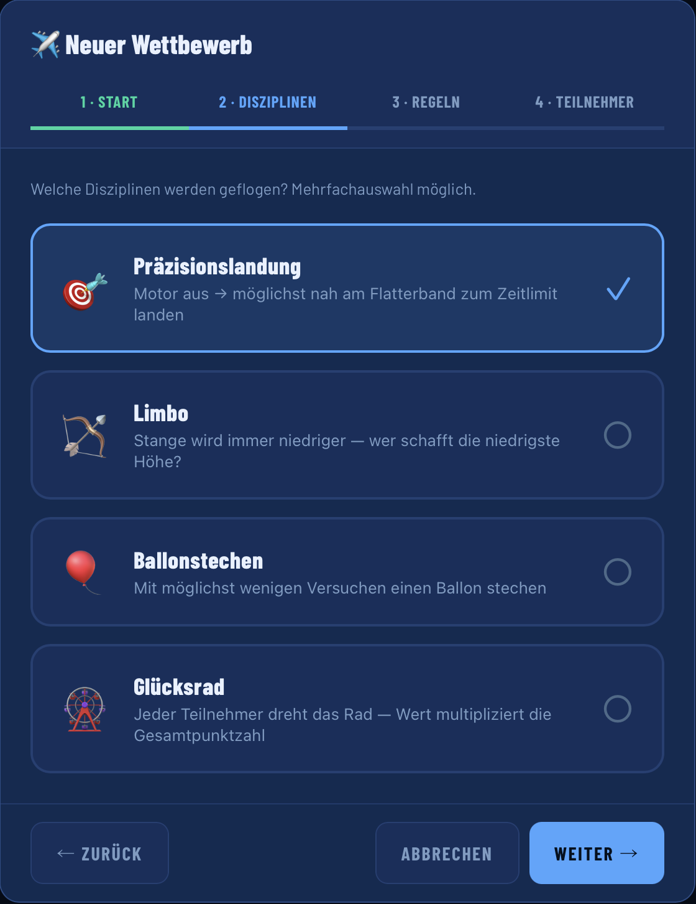
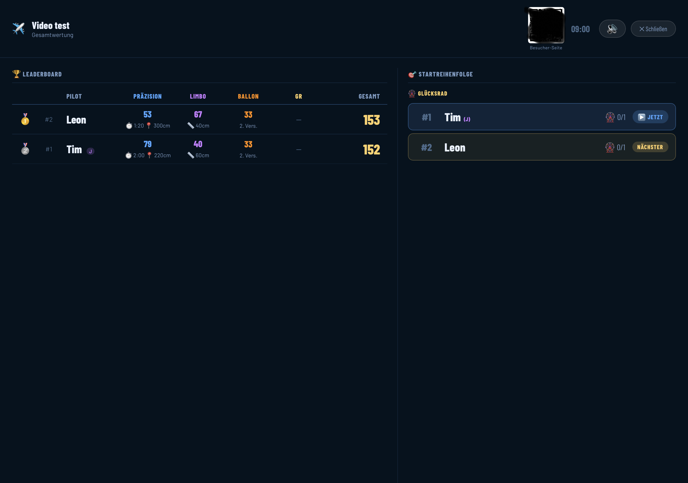
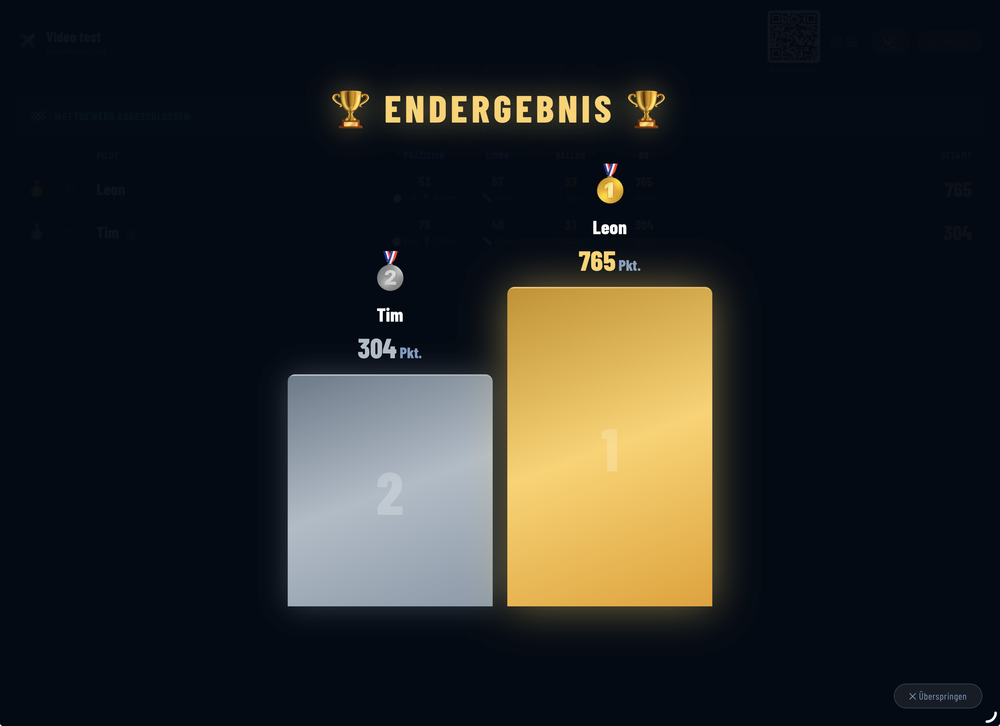
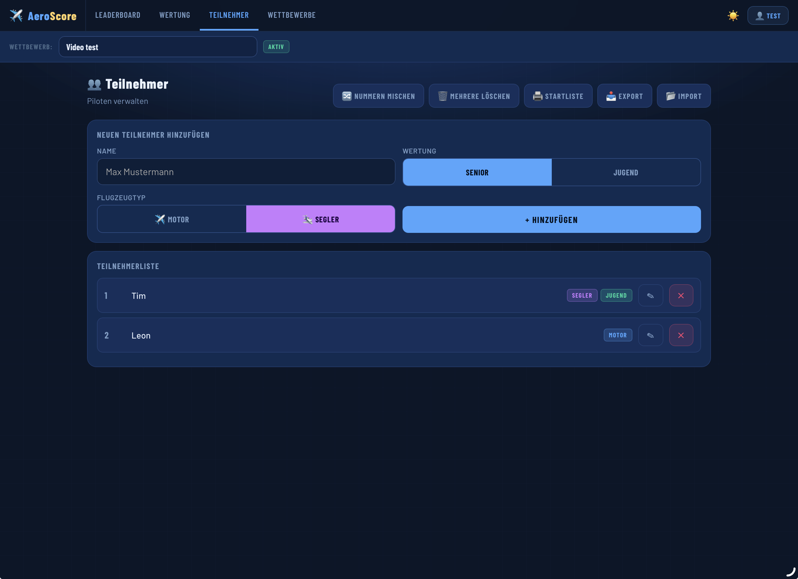
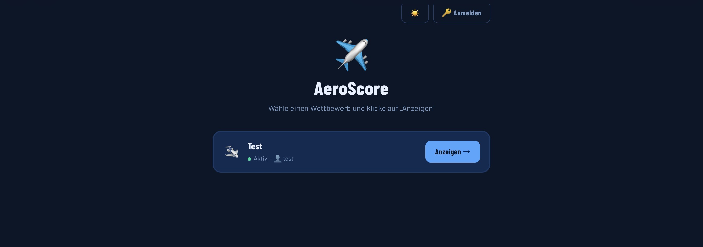
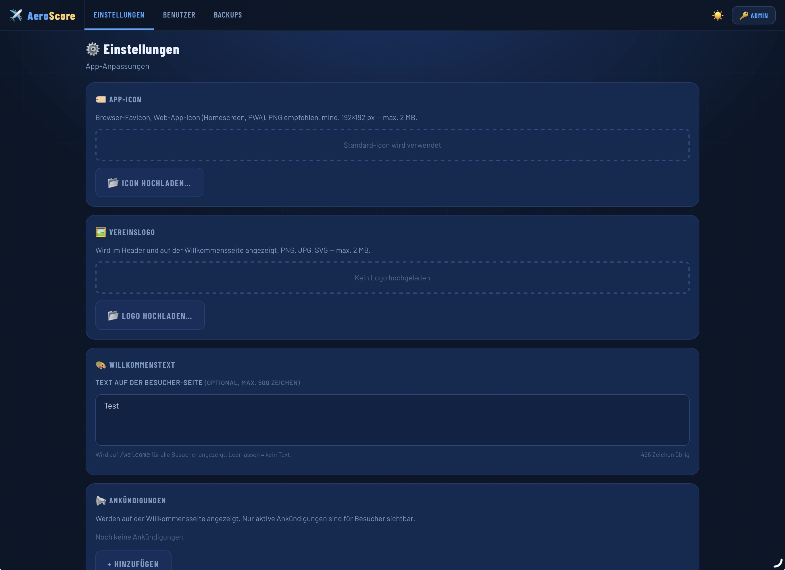

<p align="center">
  
</p>


**Wettbewerbssoftware für Modellflugvereine** — Teilnehmer verwalten, Wertungen eintragen, Ergebnisse live auf dem Beamer präsentieren.

<p align="center">
  <a href="https://www.youtube.com/watch?v=Wp0oGc_fj10">
    
  </a>
  <br>
  <a href="https://www.youtube.com/watch?v=Wp0oGc_fj10">▶ Demo-Video auf YouTube ansehen</a>
</p>

---

## Inhalt

- [Features](#features)
- [Installation](#installation)
- [Als systemd-Dienst einrichten (Autostart)](#als-systemd-dienst-einrichten-autostart)
- [Hinter einem Reverse Proxy (nginx / NPM)](#hinter-einem-reverse-proxy-nginx--npm)
- [Cloud-Backup einrichten (rclone)](#cloud-backup-einrichten-rclone)
- [Backup wiederherstellen](#backup-wiederherstellen)
- [Konfigurationsübersicht](#konfigurationsübersicht)
- [Projektstruktur](#projektstruktur)
- [Rollen](#rollen)

---

## Features

### Disziplinen
- **Präzisionslandung** — Zeit- und Abstandswertung, konfigurierbare Gewichtung, Motor- und Segelflugzeuge
- **Limbo** — Höhenstufen mit frei konfigurierbaren Punkten
- **Ballonstechen** — Mehrere Versuche pro Runde, konfigurierbare Maximalpunktzahl
- **Glücksrad** — Multiplikator auf die Gesamtpunktzahl aller anderen Disziplinen
- **Freundschaftsfliegen** — Vereinswettbewerb mit Le-Mans-Start: Loopings, Ballonstechen (3 Anflüge) und Zeitwertung pro Pilot, danach Glücksrad-Phase (×10 Bonuspunkte). Vereinswertung per Mittelwert mit konfigurierbarer Mindestteamgröße und Strafpunkten für fehlende Piloten. (Muss vom Admin in den Einstellungen freigeschaltet werden.)




### Wertung & Rangliste
- Echtzeit-Leaderboard mit Live-Update per SSE (Server-Sent Events)
- Dense Ranking (sportliche Wertung bei Gleichstand)
- Jugend- und Senior-Wertung separat umschaltbar
- **Vereinswertung** — optionale Teamwertung nach Verein (Summe oder Mittelwert), mit Detail-Ansicht pro Verein per Klick
- Umschaltung zwischen Gesamt-, Jugend- und Vereinswertung per Dropdown
- Schlechtesten Durchgang je Disziplin automatisch streichen (Präzision, Limbo, Ballon)
- Neuberechnung aller Einträge bei nachträglicher Einstellungsänderung
- **Vollbild-/Beamer-Modus** mit animierter Rangliste, Startreihenfolge, QR-Code und Siegertreppchen
- PDF-Export für alle Wertungsarten (Gesamt, Jugend, Vereinswertung)




### Verwaltung
- Mehrere Wettbewerbe parallel verwaltbar
- Wettbewerb duplizieren (Einstellungen + Teilnehmer übernehmen)
- Zugriffsverwaltung: Wettbewerbe mit anderen Benutzern teilen
- Teilnehmer und Einträge im Mehrfach-Auswahl-Modus löschen
- Druckbare Startliste
- Pilot-Ergebniskarte als Bild teilen oder herunterladen
- Abgeschlossene Wettbewerbe werden nach 14 Tagen automatisch archiviert



### Besucher-Ansicht
- Öffentliche Willkommensseite (`/welcome`) mit Live-Leaderboard
- Optionaler Passwortschutz pro Wettbewerb
- Ankündigungen (Info / Warnung / Erfolg) für Besucher
- Willkommenstext (max. 500 Zeichen) und Vereinslogo konfigurierbar



### Personalisierung
- Eigenes App-Icon hochladbar (wird auch im Browser-Tab und PWA verwendet)
- Vereinslogo für die Willkommensseite
- Eigene Fanfare-Sounds für die Siegerehrung (MP3/OGG/WAV)
- Vier eingebaute Fanfare-Stile wählbar



### Technisches
- **Offline-Modus** — Einträge werden lokal gespeichert und nach Verbindungsaufbau automatisch synchronisiert
- **PWA** — als App auf dem Homescreen installierbar
- **Automatisches Cloud-Backup** via rclone (alle 5 Minuten bei Änderungen, konfigurierbare Aufbewahrung)
- Benutzer- und Rollenverwaltung (Admin / User / Besucher)
- Optionale Impressums- und Datenschutzseiten

---

## Installation

### Schritt 1 — Node.js und npm installieren

AeroScore benötigt **Node.js v18 oder neuer** sowie **npm** (den Node.js Paketmanager). npm wird bei der Standard-Node.js-Installation automatisch mitinstalliert — ein separater Installationsschritt ist nicht nötig.

Prüfen ob beides bereits installiert ist:

```bash
node --version
npm --version
```

Wenn einer der Befehle nicht gefunden wird oder Node.js älter als v18 ist:

**Ubuntu / Debian:**
```bash
curl -fsSL https://deb.nodesource.com/setup_22.x | sudo -E bash -
sudo apt-get install -y nodejs
```

> Das Paket `nodejs` enthält auf Ubuntu/Debian seit Version 18 automatisch auch `npm`. Falls `npm` dennoch fehlt: `sudo apt-get install -y npm`

**Fedora / RHEL / Rocky Linux:**
```bash
curl -fsSL https://rpm.nodesource.com/setup_22.x | sudo bash -
sudo dnf install -y nodejs npm
```

**Windows:** Installer von [nodejs.org](https://nodejs.org/) herunterladen und ausführen. npm wird dabei automatisch mitinstalliert.

Anschließend die Installation prüfen:

```bash
node --version   # sollte v18.x oder neuer zeigen
npm --version    # sollte 9.x oder neuer zeigen
```

---

### Schritt 2 — Dateien entpacken

Die Datei `aeroscore-deploy.zip` in das gewünschte Installationsverzeichnis entpacken:

```bash
sudo unzip aeroscore-deploy.zip -d /opt/
```

Das legt einen Ordner `/opt/modellflug/` mit folgendem Inhalt an:

```
/opt/modellflug/
├── server.js
├── package.json
├── package-lock.json
├── README.md
└── public/
    ├── index.html
    ├── welcome.html
    ├── setup.html
    └── ...
```

In das Verzeichnis wechseln:

```bash
cd /opt/modellflug
```

---

### Schritt 3 — Abhängigkeiten installieren

```bash
npm install
```

Das lädt alle benötigten Pakete herunter und legt den Ordner `node_modules/` an. Eine Internetverbindung ist dafür einmalig erforderlich. Der Vorgang dauert typischerweise 20–60 Sekunden.

---

### Schritt 4 — Server starten

```bash
npm start
```

Die Ausgabe sollte so aussehen:

```
AeroScore läuft auf http://localhost:3000
```

Der Server läuft jetzt auf Port **3000** und ist im lokalen Netzwerk unter der IP-Adresse des Rechners erreichbar.

---

### Schritt 5 — Ersteinrichtung im Browser

Den Browser öffnen und folgende Adresse aufrufen:

```
http://<IP-Adresse-des-Servers>:3000/setup
```

Beispiel bei lokaler Installation: `http://localhost:3000/setup`

Auf der Setup-Seite:
1. **Admin-Benutzernamen** eingeben (z. B. `admin`)
2. **Passwort** wählen und bestätigen
3. Auf **„Einrichtung abschließen"** klicken

Danach ist die App unter `http://<IP>:3000` erreichbar und kann mit dem gewählten Admin-Konto genutzt werden.

> Die Setup-Seite ist nach der Ersteinrichtung dauerhaft gesperrt und kann nicht erneut aufgerufen werden.

---

### Schritt 6 — User-Konto anlegen

Wettbewerbe können nur von Benutzern mit der Rolle **User** erstellt werden — der Admin-Account allein reicht dafür nicht aus. Daher muss zuerst ein User angelegt werden:

1. Als Admin einloggen
2. Oben auf **„Benutzer"** klicken
3. **„Neuer Benutzer"** wählen und Name sowie Passwort vergeben — neu angelegte Benutzer erhalten automatisch die Rolle **User**
4. Den Admin-Account ausloggen und sich mit dem neuen User-Konto anmelden

### Schritt 7 — Ersten Wettbewerb anlegen

Als User eingeloggt:
1. Oben auf **„Wettbewerbe"** klicken
2. **„Neuer Wettbewerb"** wählen
3. Name, Datum und gewünschte Disziplinen konfigurieren
4. Unter **„Teilnehmer"** die Piloten eintragen
5. Unter **„Wertung"** Wertungen erfassen

---

## Als systemd-Dienst einrichten (Autostart)

Damit AeroScore automatisch beim Systemstart startet und nach Abstürzen neu gestartet wird, kann ein systemd-Dienst eingerichtet werden.

### Service-Datei erstellen

```bash
sudo nano /etc/systemd/system/aeroscore.service
```

Folgenden Inhalt einfügen (ohne Cloud-Backup — das wird im nächsten Abschnitt ergänzt):

```ini
[Unit]
Description=AeroScore Wettbewerbssoftware
After=network.target

[Service]
WorkingDirectory=/opt/modellflug
ExecStart=/usr/bin/npm start
Restart=always
RestartSec=5
User=nobody
Group=nogroup

[Install]
WantedBy=multi-user.target
```

> Hinweis: `User=nobody` sorgt dafür, dass der Prozess ohne Root-Rechte läuft. Falls `/opt/modellflug` nicht von `nobody` lesbar ist, entweder den Benutzer anpassen oder die Berechtigungen setzen:
> ```bash
> sudo chown -R nobody:nogroup /opt/modellflug
> ```

### Dienst aktivieren und starten

```bash
# systemd die neue Datei bekannt machen
sudo systemctl daemon-reload

# Dienst beim Systemstart automatisch starten
sudo systemctl enable aeroscore

# Dienst jetzt sofort starten
sudo systemctl start aeroscore

# Status prüfen
sudo systemctl status aeroscore
```

Die Ausgabe von `status` sollte `active (running)` zeigen.

### Nützliche Befehle

```bash
sudo systemctl stop aeroscore        # Dienst stoppen
sudo systemctl restart aeroscore     # Dienst neu starten
sudo journalctl -u aeroscore -f      # Logs in Echtzeit verfolgen
sudo journalctl -u aeroscore -n 50   # letzte 50 Logzeilen anzeigen
```

---

## Hinter einem Reverse Proxy (nginx / NPM)

Wenn AeroScore über einen Domainnamen erreichbar sein soll (z. B. `aeroscore.meinverein.de`), wird ein Reverse Proxy vorgeschaltet. Das ermöglicht auch HTTPS.

### nginx — Konfigurationsblock

```nginx
server {
    listen 80;
    server_name aeroscore.meinverein.de;

    location / {
        proxy_pass http://127.0.0.1:3000;
        proxy_set_header Host $host;
        proxy_set_header X-Forwarded-Proto $scheme;
        proxy_http_version 1.1;
        proxy_buffering off;
        proxy_read_timeout 3600s;
    }
}
```

Für HTTPS empfiehlt sich [Certbot](https://certbot.eff.org/), das die Konfiguration automatisch ergänzt:

```bash
sudo apt install certbot python3-certbot-nginx
sudo certbot --nginx -d aeroscore.meinverein.de
```

### Nginx Proxy Manager (NPM)

Im NPM-Webinterface unter **„Advanced"** folgendes eintragen:

```nginx
proxy_set_header X-Forwarded-Proto $scheme;
proxy_buffering off;
proxy_read_timeout 3600s;
proxy_set_header Host $host;
proxy_http_version 1.1;
```

### HTTPS dem Server mitteilen

Damit AeroScore HSTS- und CSP-Header korrekt setzt, muss `FORCE_HTTPS=true` gesetzt werden — entweder in der systemd-Service-Datei:

```ini
[Service]
Environment=FORCE_HTTPS=true
```

oder beim manuellen Start:

```bash
FORCE_HTTPS=true npm start
```

---

## Cloud-Backup einrichten (rclone)

AeroScore kann alle 5 Minuten automatisch ein Backup in die Cloud hochladen, wenn Daten geändert wurden.

### Schritt 1 — rclone installieren

```bash
sudo apt install rclone       # Debian / Ubuntu
sudo dnf install rclone       # Fedora / Rocky
```

Oder manuell von [rclone.org](https://rclone.org/downloads/).

### Schritt 2 — Cloud-Speicher einrichten

```bash
rclone config
```

Den interaktiven Assistenten durchlaufen. Für Hetzner Storage Box, Backblaze B2, Google Drive, OneDrive usw. gibt es je eigene Anleitungen auf [rclone.org/docs](https://rclone.org/docs/). Am Ende der Konfiguration hat das Remote einen Namen, z. B. `aeroscore-backup`.

Verbindung testen:

```bash
rclone lsd aeroscore-backup:
```

### Schritt 3 — Umgebungsvariablen in der systemd-Service-Datei setzen

```bash
sudo nano /etc/systemd/system/aeroscore.service
```

Im Abschnitt `[Service]` ergänzen:

```ini
[Service]
WorkingDirectory=/opt/modellflug
ExecStart=/usr/bin/npm start
Restart=always
RestartSec=5
User=nobody
Group=nogroup
Environment=RCLONE_REMOTE=aeroscore-backup
Environment=RCLONE_PATH=aeroscore/
Environment=BACKUP_KEEP=14
Environment=FORCE_HTTPS=true
```

`RCLONE_PATH` ist der Ordner im Cloud-Speicher. `BACKUP_KEEP=14` bedeutet, dass maximal 14 ZIP-Dateien aufbewahrt werden; ältere werden automatisch gelöscht.

### Schritt 4 — Dienst neu laden

```bash
sudo systemctl daemon-reload
sudo systemctl restart aeroscore
```

Den Backup-Status in der App prüfen: **Admin → Anleitungen → Backup-Status**.

---

## Backup wiederherstellen

### Option A — Per ZIP-Datei (empfohlen für Neuinstallation)

1. AeroScore auf dem neuen Server installieren (Schritte 1–4 aus [Installation](#installation))
2. Im Browser `http://<neue-IP>:3000/setup` aufrufen
3. **„Backup einspielen"** wählen und die ZIP-Datei hochladen
4. Nach der Wiederherstellung startet die App direkt mit allen Daten

### Option B — Direkt aus der Cloud (rclone)

Voraussetzung: rclone ist auf dem neuen Server eingerichtet und hat Zugriff auf das Remote.

```bash
# Daten aus der Cloud in den data/-Ordner synchronisieren
rclone sync aeroscore-backup:aeroscore/ /opt/modellflug/data/

# Server starten — kein Setup nötig, alle Daten sind bereits vorhanden
npm start
```

### Option C — Manueller ZIP-Download (aus dem Admin-Bereich)

In der laufenden App unter **Admin → Backups** eine ZIP-Datei erstellen und lokal speichern. Diese ZIP kann jederzeit per Setup-Seite wieder eingespielt werden.

---

## Konfigurationsübersicht

Der Server wird ausschließlich über Umgebungsvariablen konfiguriert. Es gibt keine Konfigurationsdatei.

| Variable | Beschreibung | Standard |
|---|---|---|
| `PORT` | HTTP-Port des Servers | `3000` |
| `RCLONE_REMOTE` | Name des konfigurierten rclone-Remotes | — (kein Backup) |
| `RCLONE_PATH` | Pfad/Ordner im Cloud-Speicher | `modellflug/` |
| `BACKUP_KEEP` | Maximale Anzahl aufzubewahrender Backup-ZIPs | `14` |
| `FORCE_HTTPS` | HSTS & CSP-Header erzwingen (hinter HTTPS-Proxy) | `false` |

**Beispiel — manueller Start mit allen Optionen:**

```bash
PORT=3000 FORCE_HTTPS=true RCLONE_REMOTE=aeroscore-backup RCLONE_PATH=aeroscore/ BACKUP_KEEP=30 npm start
```

---

## Projektstruktur

```
/opt/modellflug/
├── server.js          — Backend (Node.js / Express)
├── package.json       — Abhängigkeiten und npm-Skripte
├── package-lock.json
├── Readme.md
├── public/
│   ├── index.html     — Haupt-App (Single-Page-App)
│   ├── welcome.html   — Besucher-Ansicht mit Live-Leaderboard
│   ├── setup.html     — Ersteinrichtung
│   └── ...            — Icons, Fonts, Sounds, Service Worker
└── node_modules/      — installierte Pakete (nicht anfassen)
```

Beim ersten Start legt der Server automatisch den `data/`-Ordner an:

```
data/
├── wettbewerb.json    — alle Wettbewerbe, Teilnehmer und Einträge
├── users.json         — Benutzerkonten und aktive Sessions
├── config.json        — App-Einstellungen (Logo, Texte, Sounds …)
├── logo.*             — Vereinslogo (optional, wird per App hochgeladen)
├── icon.*             — App-Icon (optional, wird per App hochgeladen)
└── sounds/            — eigene Fanfare-Sounds (optional)
```

> **Wichtig:** Nur der `data/`-Ordner enthält persistente Daten. Für ein manuelles Backup reicht es, diesen Ordner zu kopieren.

---

## Rollen

| Rolle | Rechte |
|---|---|
| **Admin** | Alles: Benutzer verwalten, Einstellungen, Backup, alle Wettbewerbe |
| **User** | Wettbewerbe anlegen und verwalten, Teilnehmer und Wertungen erfassen |
| **Besucher** | Leaderboard ansehen (bei passwortgeschützten Wettbewerben nach Eingabe des Passworts) |

---

## Hinweis zur KI-Unterstützung

Diese Software wurde vollständig mithilfe von **Claude** (einem KI-Assistenten von Anthropic) entwickelt. Der Autor hat die Anforderungen definiert, Entscheidungen getroffen und das Ergebnis geprüft — der Code selbst wurde durch den Dialog mit der KI generiert.

Das AeroScore-Logo wurde mit **Google Gemini** erstellt.

**Haftungsausschluss:** Die Software wird so bereitgestellt, wie sie ist (*as-is*), ohne jegliche Garantie auf Korrektheit, Vollständigkeit oder Eignung für einen bestimmten Zweck. Der Autor übernimmt keinerlei Haftung für Schäden, Datenverluste oder sonstige Probleme, die durch die Verwendung dieser Software entstehen. Die Nutzung erfolgt auf eigene Verantwortung.

---

## Lizenz

[](https://creativecommons.org/licenses/by-nc/4.0/)

